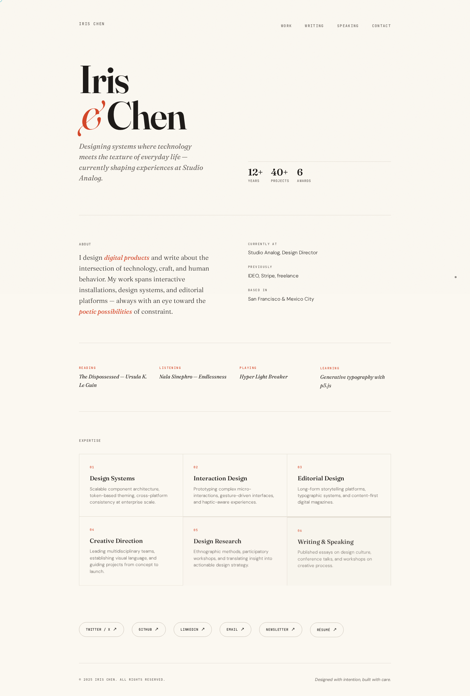
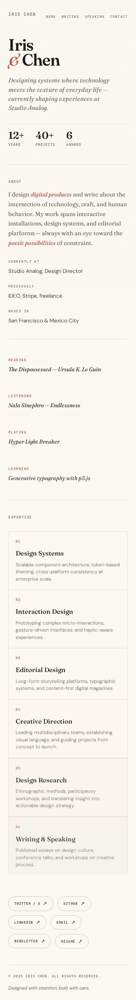

# user-profile

A distinctive, editorial-style public profile page — a digital calling card with warmth and character. Built as a self-contained single-file HTML/CSS/JS page with no dependencies.

**Demo**: [user-profile-lake.vercel.app](https://user-profile-lake.vercel.app)

## Preview

| Desktop | Mobile |
|---|---|
|  |  |

---

## Design

**Aesthetic**: *Warm Editorial* — a refined, magazine-quality profile that feels like a beautifully typeset broadsheet. Warm paper tones, confident serif typography, asymmetric layout, and subtle atmospheric details.

| Element | Choice |
|---|---|
| Display typeface | [Fraunces](https://fonts.google.com/specimen/Fraunces) (variable serif) |
| Body typeface | [DM Sans](https://fonts.google.com/specimen/DM+Sans) |
| Mono typeface | [JetBrains Mono](https://fonts.google.com/specimen/JetBrains+Mono) |
| Background | `#FBF8F1` (warm cream paper) |
| Text | `#1C1917` (deep warm charcoal) |
| Accent | `#D44527` (terracotta) |
| Texture | SVG fractal noise grain overlay |

### Sections

- **Hero** — oversized name, tagline, and career stats
- **Bio** — two-column layout with professional details
- **Currently** — personal flavor (reading, listening, playing, learning)
- **Expertise** — 6-card grid showcasing skills
- **Links** — pill-shaped social/profile links with hover animations
- **Footer** — minimal closing with credit line

### Motion

Scroll-triggered staggered fade-up reveals using `IntersectionObserver`. Each section animates in as it enters the viewport. Links use a directional fill hover effect. Cards have staggered entrance delays for a cascading reveal.

### Responsive

Breakpoints at 768px and 480px. Editorial proportions are maintained down to mobile, where the grid collapses to single column.

---

## Tech

- **Zero dependencies** — vanilla HTML, CSS, and JavaScript
- **Self-contained** — all styles and scripts embedded in a single `index.html`
- **Google Fonts** — loaded via CDN (`Fraunces`, `DM Sans`, `JetBrains Mono`)
- **CSS-only animations** — no animation libraries needed
- **Print stylesheet** — included for clean print output

---

## Deploy

Deployed on [Vercel](https://vercel.com) with zero configuration. To deploy your own:

```bash
# Clone
git clone https://github.com/carlomigueldy/user-profile.git
cd user-profile

# Deploy (requires Vercel CLI)
vercel --prod
```

Or drag `index.html` onto any static host (Netlify, GitHub Pages, S3, etc.) — it's a single file.

---

## License

MIT
